# RHEL Installation

การติดตั้ง RedHat 10 นั้นไม่มีอะไรยุ่งยาก และมีวิธีการติดตั้งลักษณะเดียวกันกับ RedHat เวอร์ชันก่อนๆ ซึ่งในการศึกษานี้เราจะเลือกใช้ x86_64 Architecture ในการติดตั้งและทำ LAB และสำหรับการศึกษานี้จะเลือกใช้ RHEL Version 10.1

และเลือกใช้ VirtualBox ซึ่งเป็น Free Tool สำหรับจำลองเครื่องคอมพิวเตอร์เพื่อใช้งานได้โดยไม่มีค่าใช้จ่ายและสะดวกแก่ทุกคนในการเริ่มต้นศึกษา

คุณสามารถติดตั้งและทดสอบระบบลงใน Virtual Machine อย่าง VMware ESX, VMware Workstation, VirtualBox

## Download RHEL ISO image
คุณสามารถ Download RHEL ISO image ได้จาก URL ดังนี้
> https://developers.redhat.com/products/rhel/download

หรือ Direct URL ของเวอร์ชัน 10.1 ดังนี้
> https://developers.redhat.com/content-gateway/file/rhel/Red_Hat_Enterprise_Linux_10.1/rhel-10.1-x86_64-dvd.iso

## Download VirtualBox
สามารถ Download VirtualBox ฟรีได้จากเว็บไซต์โดยตรง
> https://www.virtualbox.org/
>
> Windows:
> https://download.virtualbox.org/virtualbox/7.2.6/VirtualBox-7.2.6a-172322-Win.exe
>
> MacOS Intel:
> https://download.virtualbox.org/virtualbox/7.2.6/VirtualBox-7.2.6-172322-OSX.dmg
>
> MavOS Apple Silicon:
> https://download.virtualbox.org/virtualbox/7.2.6/VirtualBox-7.2.6-172322-macOSArm64.dmg

หลังจาก Download แล้วให้ติดตั้ง VirtualBox ให้เรียบร้อย

Extension Pack (Optional)
> https://download.virtualbox.org/virtualbox/7.2.6/Oracle_VirtualBox_Extension_Pack-7.2.6.vbox-extpack

## ติดตั้ง RHEL
ตั้งค่า Hardware ใน
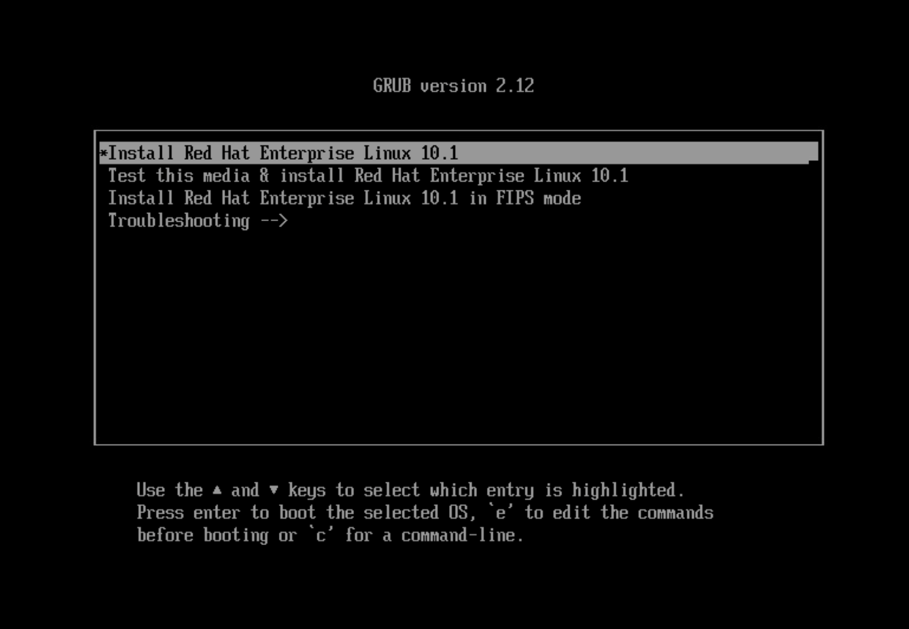

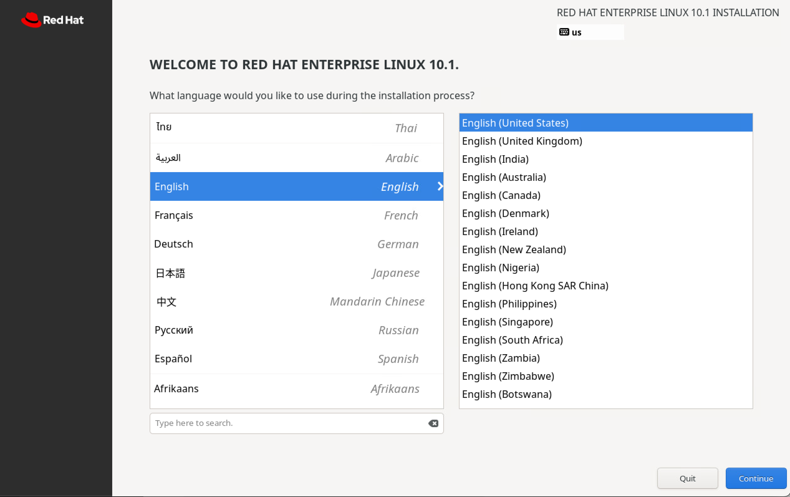

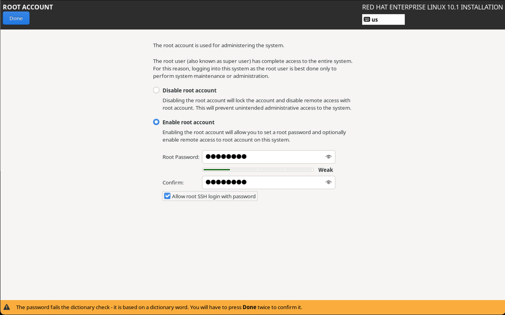

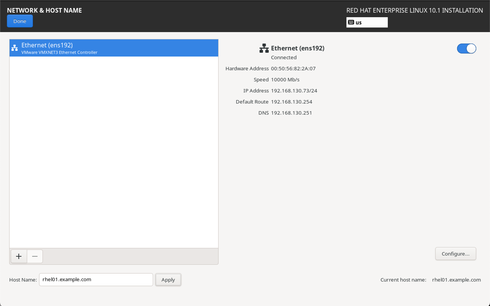

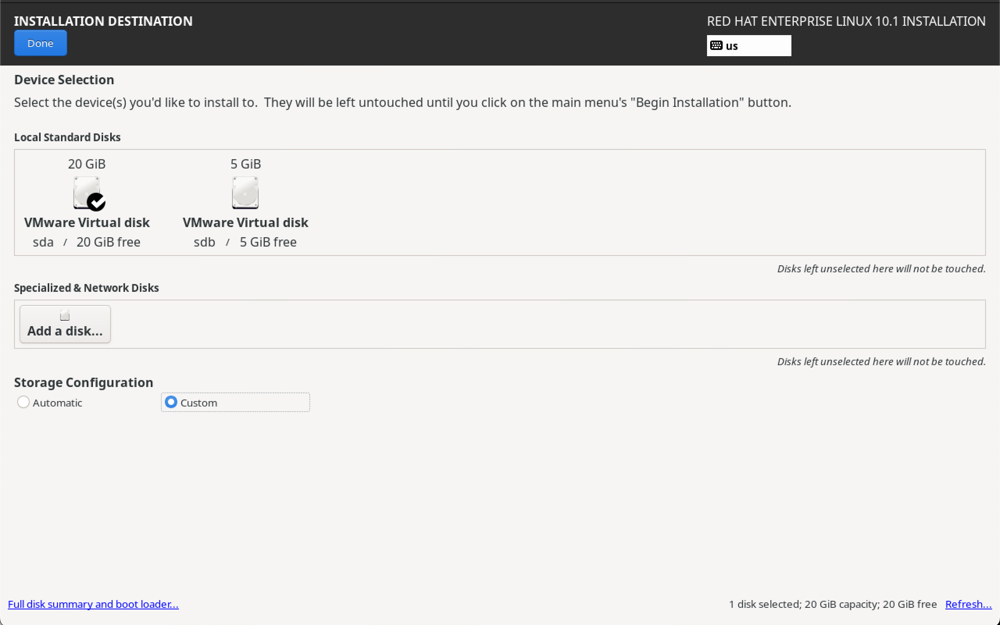

แบ่ง Partition ดังนี้

| Partition | Size |
|:-------- | --------:|
|	/boot			| 1GB		|
|	/boot/efi	| 1GB		|
| swap			|	3GB		|
|	/var			| 6GB		|
| /home     | 3GB   |
| /					|	6GB		|

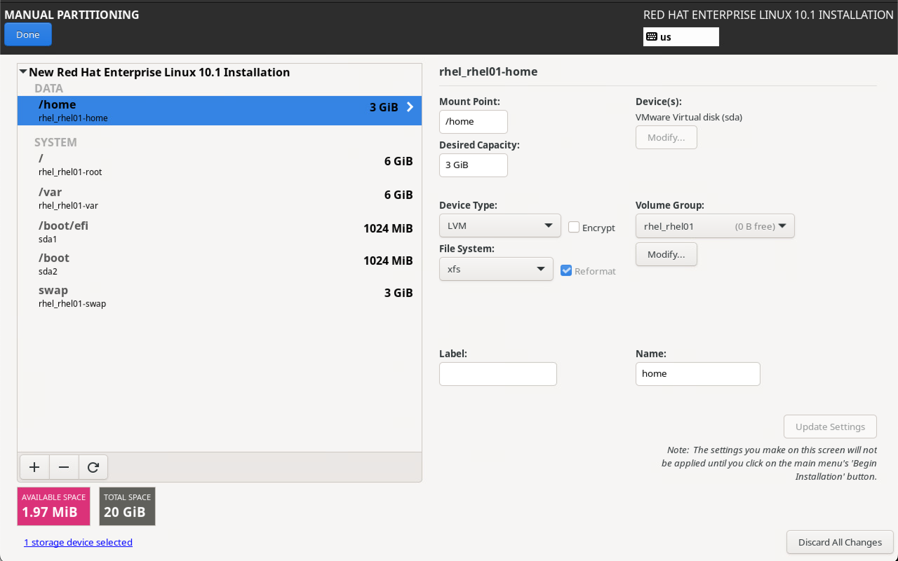

กด Accept Changes
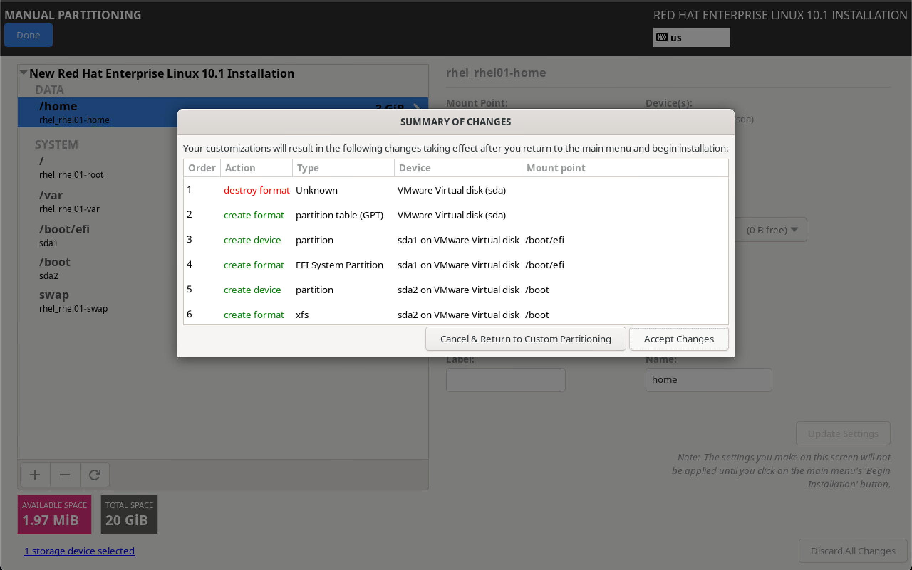

กด Begin Installation
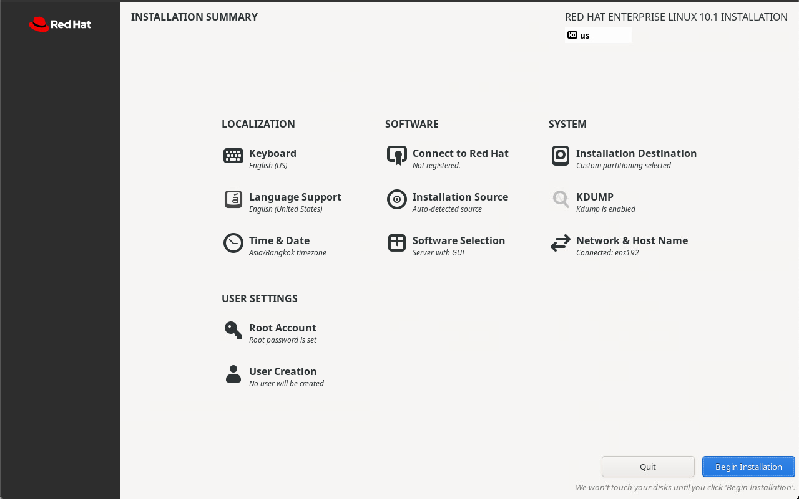

รอจนติดตั้งเสร็จแล้วกด Reboot System
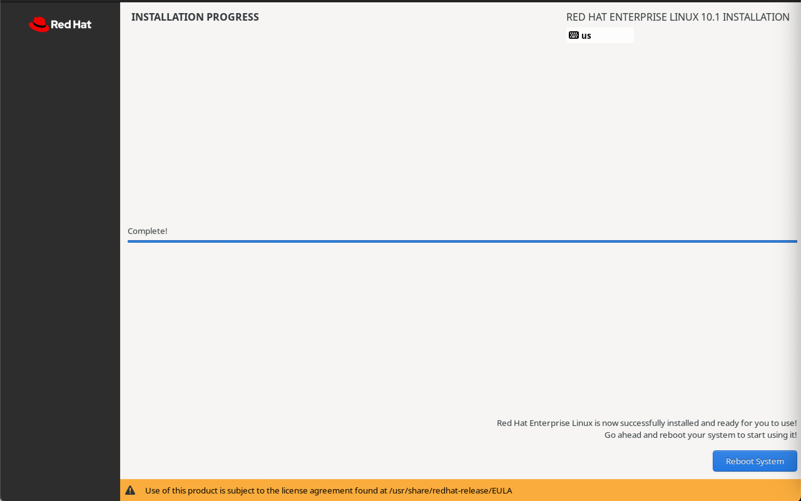

หลังจากนั้นตั้งค่าเบื้องต้นสำหรับการใช้งาน GUI
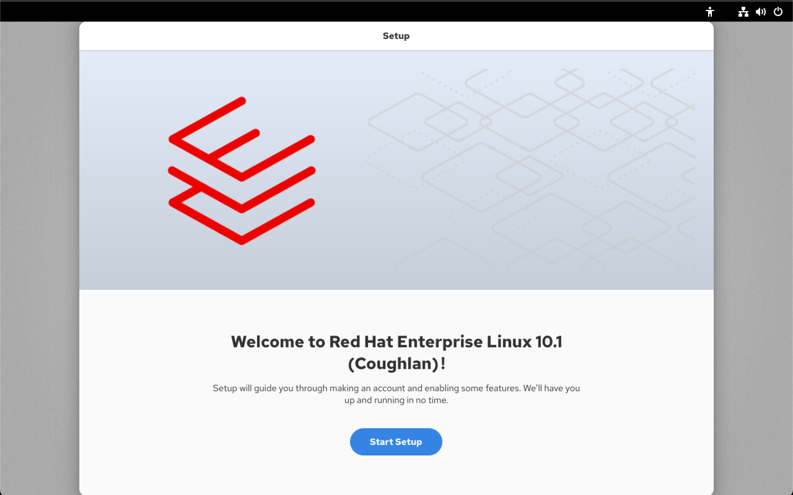

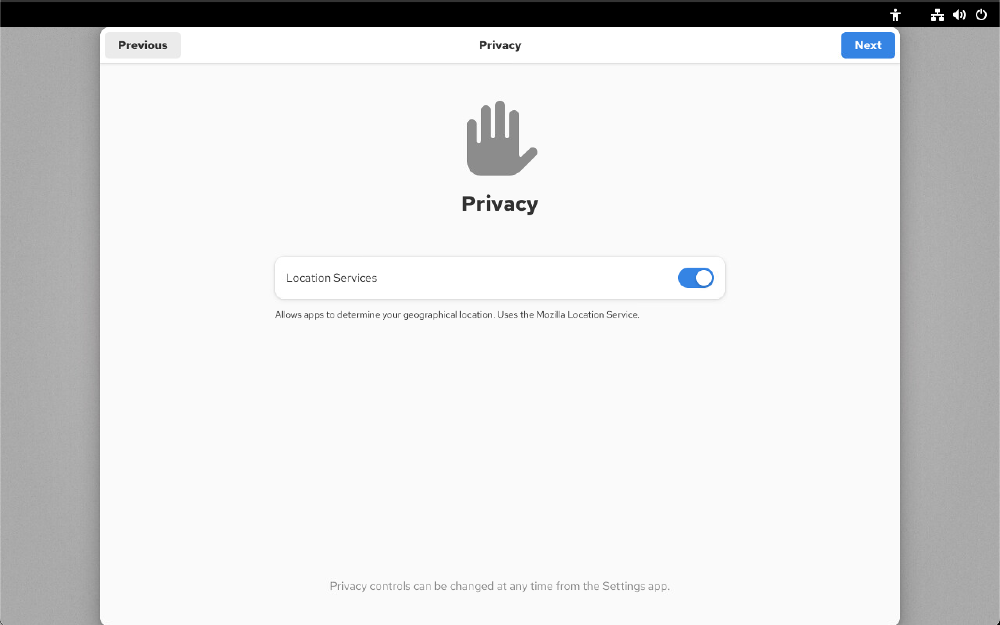

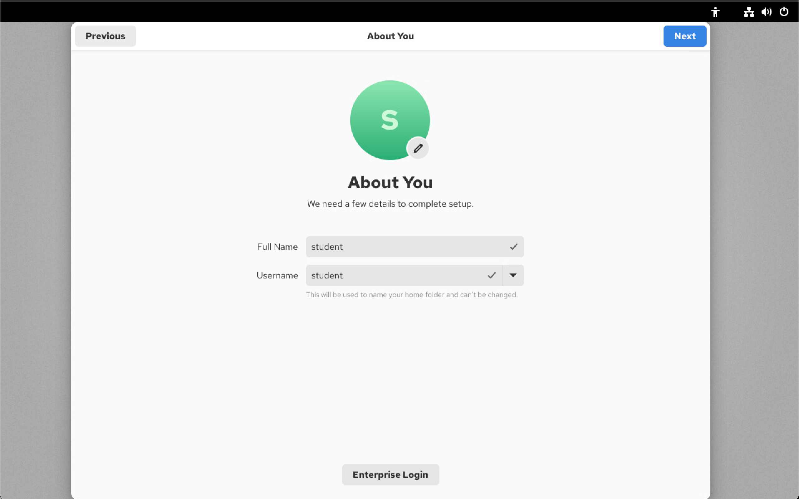

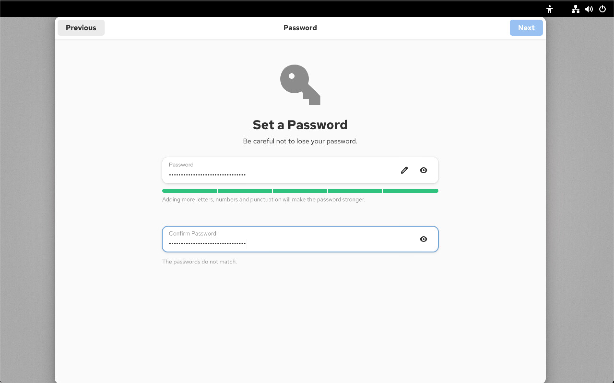

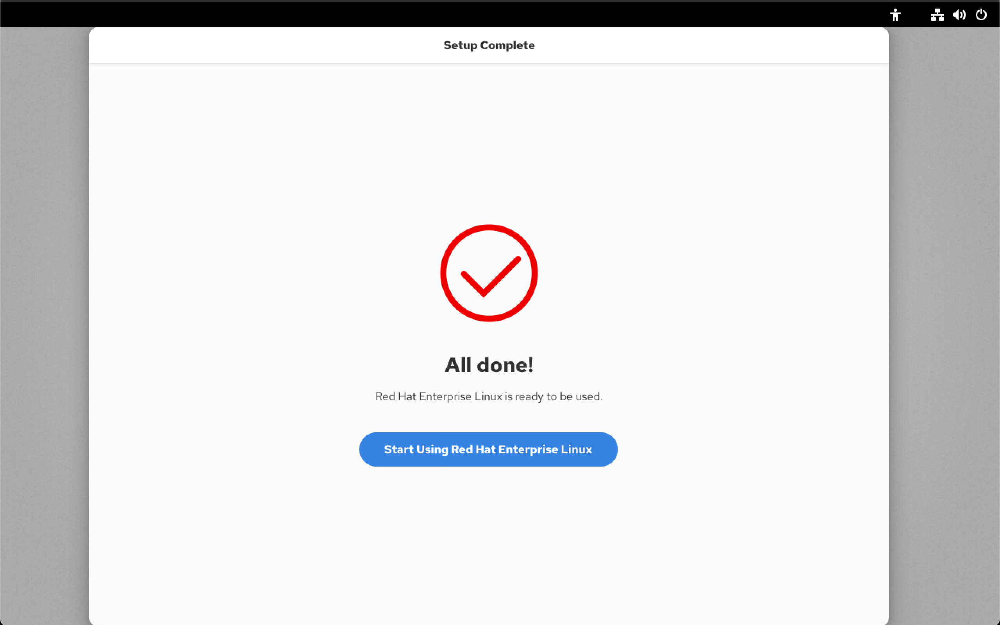

เมื่อตั้งค่าเบื้องต้นเสร็จสิ้นจะได้พื้นที่ Desktop GUI ลักษณะนี้
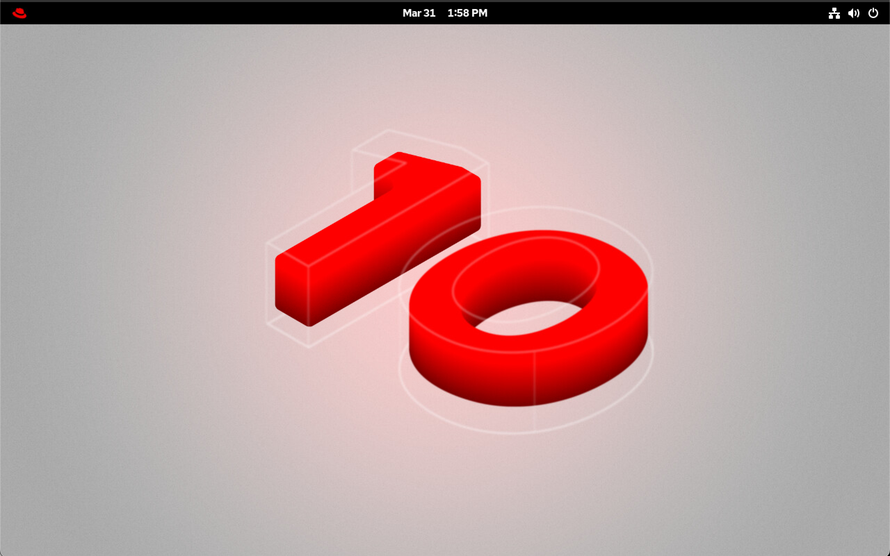

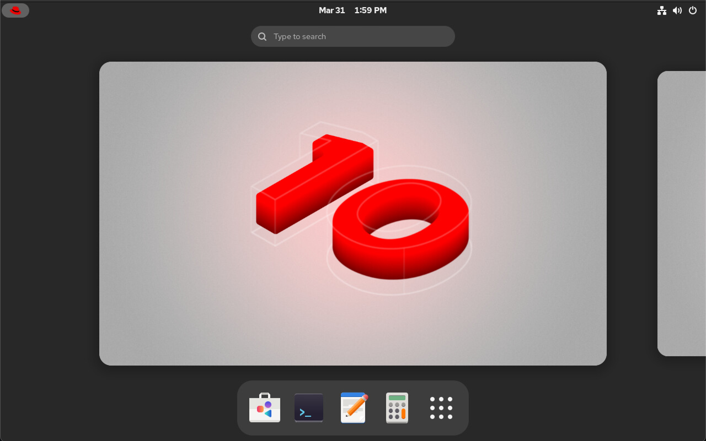